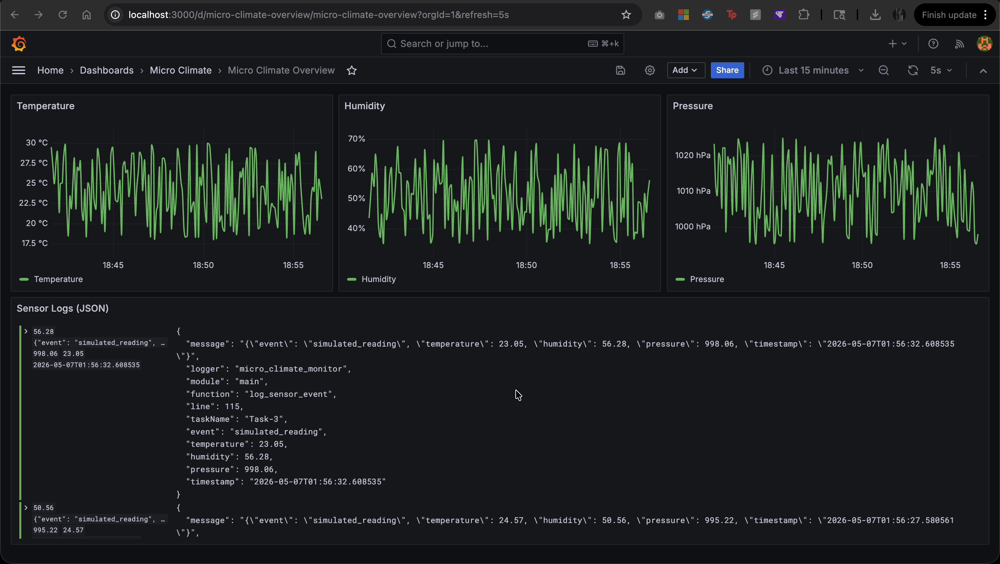
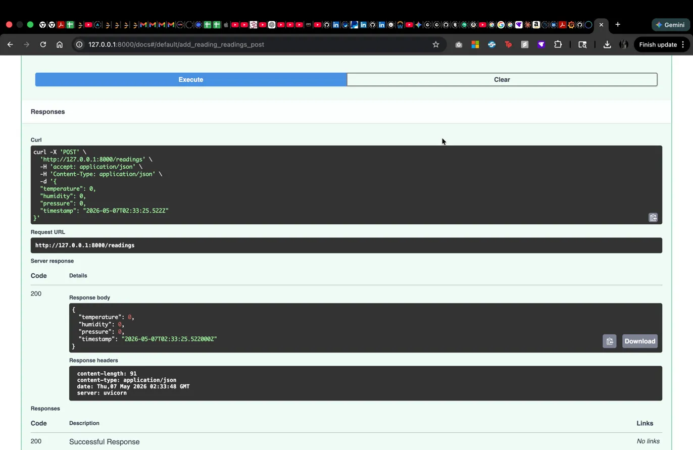
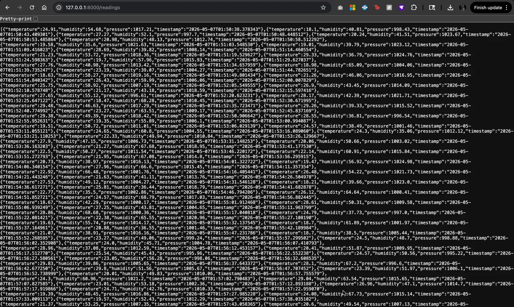
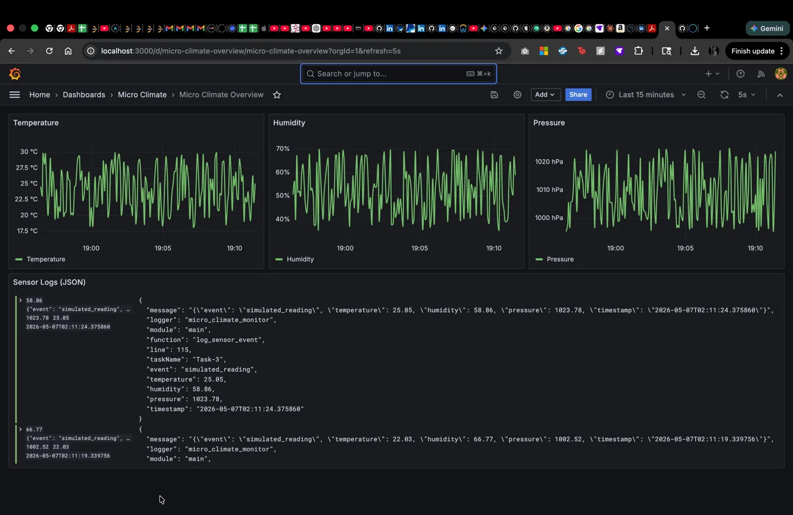
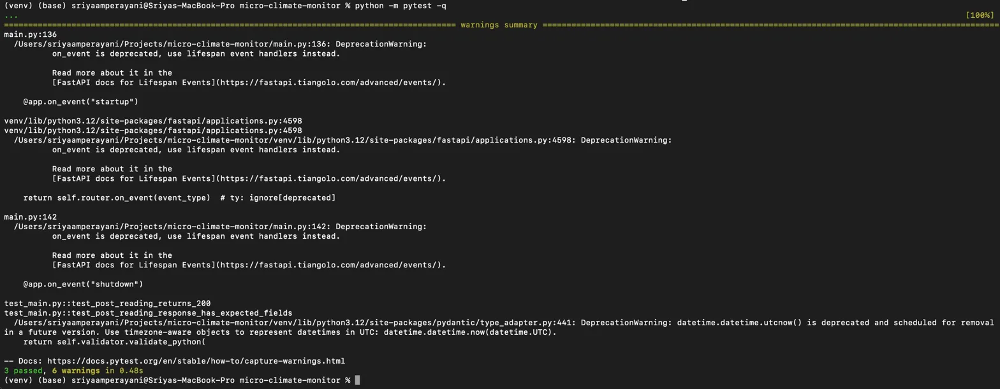

# Micro Climate Monitor

Real-time environmental monitoring system with anomaly detection and live Grafana dashboards.




---

## Architecture

Background Simulator (every 5s)
        │
        ▼
   FastAPI App ──────────────► Loki (log storage)
   /readings                          │
   /anomalies (2σ detection)          ▼
                               Grafana Dashboard


---

## Stack

| Layer | Tech |
|---|---|
| Backend | Python, FastAPI, Uvicorn |
| Observability | Grafana, Loki |
| Infrastructure | Docker Compose |
| Testing | pytest |

---

## Quick Start

git clone https://github.com/sriyaamperayani/Micro-Climate-Monitor.git
cd Micro-Climate-Monitor
python -m venv venv && source venv/bin/activate
pip install -r requirements.txt
cp .env.example .env
docker compose up -d
uvicorn main:app --reload

| Service | URL |
|---|---|
| API + Swagger | http://127.0.0.1:8000/docs |
| Grafana Dashboard | http://localhost:3000 |

---

## API

### `POST /readings` — ingest a sensor reading


### `GET /readings` — fetch all stored readings


### `GET /anomalies` — returns readings exceeding 2σ from mean


---

## Dashboard



Grafana datasource and dashboard are auto-provisioned on `docker compose up` — no manual setup needed.

---

## Tests

\```bash
python -m pytest -q -W ignore::DeprecationWarning
\```



---

## Security Notes

- Never commit `.env` — use `.env.example` as template
- Default Grafana credentials (`admin/admin`) are for local dev only
- Use AWS Secrets Manager or HashiCorp Vault in production
